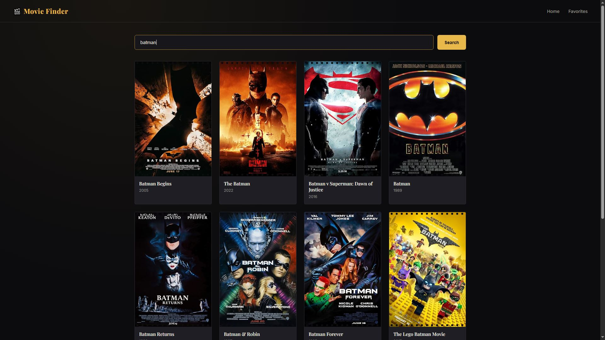
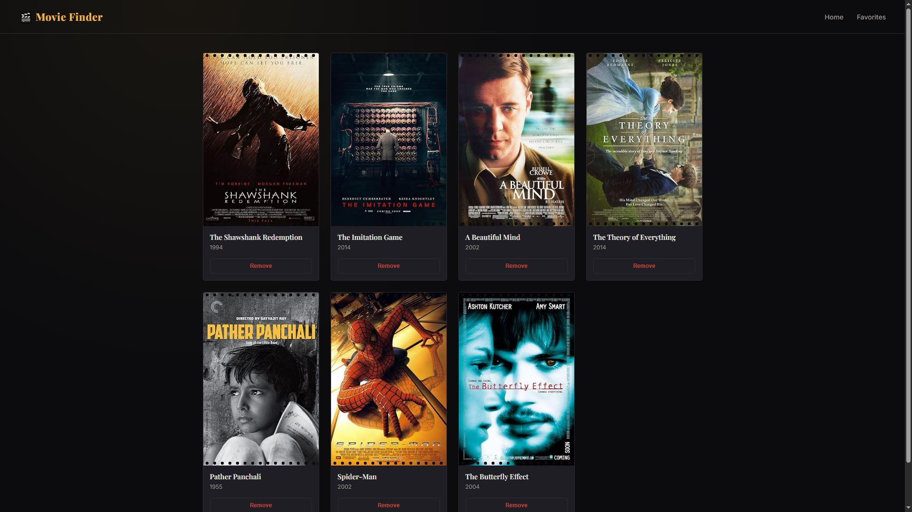

# 🎬 Movie Finder

A full-stack React movie search app with live search, persistent favorites, and a custom CI/CD pipeline deploying to AWS EC2.

**[Live Demo →](http://13.53.36.113)**




---

## Features

- 🔍 **Live search** — debounced search-as-you-type against the OMDb API
- 🎞️ **Movie details** — full info page with poster, plot, director, rating
- ⭐ **Favorites** — save/remove movies, persisted across sessions
- 🧭 **Client-side routing** — multi-page navigation with React Router
- 🎨 **Custom cinema-themed UI** — dark theme with film-strip styled cards
- 🚀 **Automated deployment** — every push to `main` builds and deploys automatically via GitHub Actions

---

### Movie Details Page


### Favorites Page



---

## Tech Stack

**Frontend**
- React 19
- React Router — client-side routing
- Zustand — state management (favorites store)
- Vite — build tooling
- Custom CSS (no framework)

**API**
- [OMDb API](https://www.omdbapi.com/) — movie search and details

**Infrastructure & DevOps**
- AWS EC2 (Ubuntu) — hosting
- nginx — static file serving + SPA routing
- GitHub Actions — CI/CD pipeline
- AWS IAM — scoped permissions for automated security group management
- `rsync` over SSH — deployment transport

---

## Architecture

```
┌─────────────┐     push to main      ┌──────────────────┐
│   GitHub    │ ─────────────────────▶│  GitHub Actions   │
│    Repo     │                        │  (build + test)   │
└─────────────┘                        └────────┬──────────┘
                                                 │
                                   1. temporarily opens SSH
                                   2. rsyncs dist/ to EC2
                                   3. closes SSH
                                                 ▼
                                        ┌──────────────────┐
                                        │   AWS EC2         │
                                        │   (nginx serving   │
                                        │    static build)   │
                                        └──────────────────┘
```

On every push to `main`, GitHub Actions:
1. Builds the app (`npm run build`)
2. Authenticates to AWS and temporarily opens SSH access on the EC2 security group
3. Deploys the build via `rsync` to the EC2 instance
4. Immediately revokes SSH access again

---

## Local Development

```bash
git clone https://github.com/YOUR_USERNAME/YOUR_REPO.git
cd YOUR_REPO
npm install
```

Create a `.env` file in the project root:
```
VITE_OMDB_API_KEY=your_omdb_api_key_here
```
(Get a free key at [omdbapi.com/apikey.aspx](https://www.omdbapi.com/apikey.aspx))

Run the dev server:
```bash
npm run dev
```

Build for production:
```bash
npm run build
```

---

## Project Structure

```
src/
  pages/          # Route-level components (Home, MovieDetails, Favorites)
  hooks/          # Custom hooks (useFetch)
  store/          # Zustand store (favorites)
  MovieApp.jsx    # Root component, routing setup
  MovieApp.css    # App-wide styles
```
---

## Future Scope

- **Sort & filter** — sort search results by year, filter by type (movie/series/episode)
- **Pagination** — browse beyond OMDb's default 10-results-per-search limit
- **TypeScript migration** — add static typing across components and API responses
- **Testing** — unit tests for hooks/store logic, component tests with React Testing Library
- **Custom domain + HTTPS** — move off the raw EC2 IP with a domain name and Let's Encrypt SSL
- **CI test gate** — run tests in the GitHub Actions pipeline before allowing a deploy to proceed
- **Watchlist / "want to watch" list** — separate from favorites, for movies not yet seen
- **Trailer embeds** — pull trailer links into the movie detail page
- **Improved error states** — retry button on failed searches, better empty-state messaging

---

## What I Learned Building This

This project was built as a hands-on way to learn React from the ground up — components, hooks, routing, state management — and to go beyond the frontend into real deployment: provisioning a Linux server, configuring nginx, and building a secure, automated CI/CD pipeline on AWS.

---

## Technical Challenges & Decisions

### State Management: Context API → Zustand

Favorites were initially implemented with React's Context API. As the number of components consuming favorites grew (search results, detail page, and the favorites list), a key limitation became clear: **any component subscribed to the context re-renders on *any* change to the context value**, regardless of which specific field it actually reads. A component that only checked whether a single movie was added to favorites or not, would still re-render every time the entire favorites list changed.

I migrated the favorites store to **Zustand**, which uses per-selector subscriptions instead of a single shared value. Components select only the exact slice of state they need (`useFavoritesStore((state) => state.favorites)`), so a component reading only an action function (e.g. `addFavorite`) never re-renders when the underlying data changes — since that function reference is stable across updates. This also removed the need for a `Provider` wrapping the component tree entirely, simplifying the app's root component.

### Debugging a Layout Bug Across Environments

A styling inconsistency (inconsistent grid column counts depending on search result content) turned out to trace back to a leftover default stylesheet from the project's initial Vite scaffold (`index.css`), which was still being loaded alongside the app's custom styles and silently overriding container widths. The bug was intermittent-looking because it only became visible depending on incidental content length — tracked down by systematically comparing computed styles up the DOM tree in browser devtools rather than guessing at CSS rules, isolating the exact ancestor element where the width diverged from expected.

### Secure, Automated Deployment on AWS

The CI/CD pipeline deploys over SSH to an EC2 instance, which required balancing automation with a minimal attack surface. Rather than leaving SSH permanently open to enable GitHub Actions' dynamic IP ranges, the pipeline:

1. Authenticates as a dedicated IAM user with a narrowly-scoped policy (permission to modify *only* the specific security group in use — nothing else in the AWS account)
2. Temporarily opens inbound SSH access immediately before the deploy step
3. Deploys the build via `rsync`
4. **Revokes SSH access again immediately afterward**, using a step configured to run regardless of whether the deploy succeeded or failed — ensuring the port is never left open due to an error mid-pipeline

This keeps the server's attack surface closed by default, opening SSH only for the brief window an actual deployment is in progress.

---

## Author

**Surojit Jana**

B.Tech in Computer Science & Engineering

Government College of Engineering & Leather Technology (GCELT)

---

## License

MIT
